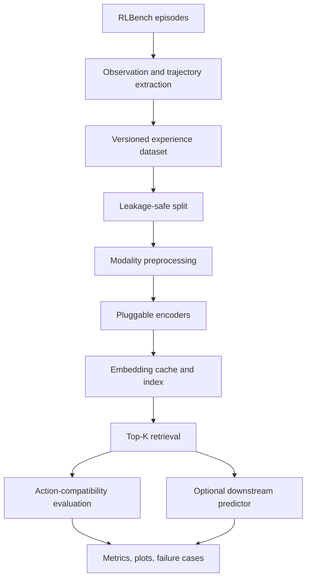

# Implementation Specification: Action-Aware 3D Retrieval for Robotic Manipulation

## 0. Instructions to the Coding Planner

You are asked to design and implement a research codebase for a one-month mini-research project in Deep Learning for 3D Computer Vision. The project studies whether pretrained 3D representations can retrieve robotic demonstrations that are useful for manipulation planning, and whether such retrieval is more robust than image-based retrieval under controlled scene changes.

Do not begin by implementing every optional component. First inspect the target machine, available GPUs, operating system, Python/CUDA versions, and whether RLBench/CoppeliaSim can run. Then produce a concrete implementation plan and build the project in the phases defined in Section 18.

The implementation must be:

- modular and configuration-driven;
- reproducible from command-line scripts;
- safe against train/test leakage;
- able to run small smoke tests without a GPU or simulator where practical;
- explicit about third-party code versus project-owned code;
- capable of running a matrix of experiments without editing source code;
- designed so that a failed optional dependency does not block unrelated baselines;
- documented well enough that another researcher can reproduce every reported result.

The final deliverable must contain code, configuration files, tests, a `requirements.txt` or `environment.yml`, and a README with exact reproduction commands.

---

## 1. Research Objective

### 1.1 Primary research question

> Do pretrained 3D representations retrieve demonstrations that are geometrically similar and action-compatible for robotic manipulation, and are they more robust than image representations under viewpoint, appearance, noise, and partial-observation changes?

### 1.2 Secondary research question

> Can a lightweight action-aware adaptation of a frozen 3D representation improve the retrieval of transferable demonstrations?

### 1.3 Downstream question

> Does better action-aware retrieval improve target-pose prediction, trajectory prediction, or task success in RLBench?

### 1.4 Core hypotheses

H1. A frozen pretrained 3D encoder retrieves more action-compatible demonstrations than random retrieval.

H2. Compared with image retrieval, geometry-only 3D retrieval degrades less under nuisance appearance changes that do not alter the correct action.

H3. A frozen foundation embedding may capture semantic/object similarity while failing to preserve task-relevant pose and spatial relations.

H4. A small action-aware projection head trained with trajectory-derived supervision improves retrieval compatibility over the frozen embedding.

H5. Improvements in retrieval metrics do not necessarily imply downstream planning improvements; both must be evaluated separately.

### 1.5 Valid negative results

The infrastructure must support rigorous negative conclusions. Examples:

- image retrieval matches or outperforms 3D retrieval;
- a simple pose descriptor outperforms a 3D foundation model;
- adaptation improves Recall@K but not downstream success;
- oracle retrieval does not help the downstream model, indicating that retrieval is not the bottleneck;
- global 3D embeddings discard task-relevant pose information.

---

## 2. Scope and Priority

### 2.1 Required MVP

The MVP is complete when the codebase can:

1. load or generate RLBench demonstrations for at least one task;
2. persist RGB, point cloud, trajectory, task metadata, and success information;
3. create leakage-safe database/query splits by episode;
4. compute at least one image embedding and one 3D or explicit geometric representation;
5. retrieve Top-K demonstrations with a common retrieval API;
6. calculate an action-compatibility ground truth from trajectories;
7. report Random, Image, and 3D retrieval metrics;
8. apply at least one controlled perturbation;
9. save configurations, predictions, metrics, and qualitative retrieval figures.

### 2.2 Target project

After the MVP, add:

- three RLBench tasks;
- multiple perturbation strengths;
- an action-aware projection head;
- clean versus perturbed retrieval curves;
- a simple downstream trajectory/target predictor;
- an oracle retrieval upper bound;
- ablations for geometry, pose, color, and adaptation.

### 2.3 Stretch goal

A conditional Flow Matching trajectory planner is a stretch goal. Do not make it a dependency of the retrieval study. Implement it only after all required retrieval experiments and at least one simpler downstream evaluation are reproducible.

### 2.4 Non-goals for the first month

- training a large 3D foundation model from scratch;
- fine-tuning all parameters of Uni3D/PTv3 before a projection-head baseline works;
- evaluating dozens of RLBench tasks;
- building a production robotics system;
- claiming real-world robot transfer;
- claiming a novel foundation architecture;
- using manually selected qualitative examples as the main evidence.

---

## 3. Core Terminology and Data Semantics

### 3.1 Demonstration

A demonstration is a complete recorded attempt to perform a robotic task:

\[
D_i=\{(o_0,a_0),(o_1,a_1),\ldots,(o_T,a_T)\}.
\]

It includes what the robot observed, what it did, and the result.

### 3.2 Experience record

For retrieval, store a compact experience representation:

\[
e_i=(P_i,I_i,\tau_i,y_i),
\]

where:

- \(P_i\): point cloud representation of the scene;
- \(I_i\): RGB image representation of the same scene;
- \(\tau_i\): end-effector/action trajectory;
- \(y_i\): task, variation, episode, target, and outcome metadata.

The experience tuple is not itself an embedding. Only the selected scene modality is passed through an encoder.

### 3.3 Query and retrieval database

A query is a held-out experience whose scene is used for retrieval. Its ground-truth trajectory is hidden from the retriever and used only for training labels or evaluation.

The retrieval database contains experiences from different episodes. No frame from the same episode may occur in both the query split and database split.

### 3.4 Image retrieval

\[
z_i^{image}=f_{image}(I_i).
\]

Nearest neighbors are found in the image-embedding space.

### 3.5 3D retrieval

\[
z_i^{3D}=f_{3D}(P_i).
\]

Nearest neighbors are found in the 3D-embedding space. The experiment must explicitly record whether `P_i` contains `XYZ`, `XYZRGB`, a target crop, a local scene crop, a single camera, or fused multi-view points.

### 3.6 Action compatibility

Action compatibility measures whether two demonstrations require similar robot behavior. It is derived from trajectories and task state, not from the embeddings being evaluated.

---

## 4. System Architecture



The implementation should separate offline and online stages.

### 4.1 Offline stage

1. Generate or import demonstrations.
2. Extract and validate experience records.
3. Create immutable dataset manifests and split manifests.
4. Precompute database embeddings.
5. Build an exact or approximate nearest-neighbor index.

### 4.2 Query/evaluation stage

1. Load a query scene.
2. Apply a configured perturbation to the query only, unless an experiment explicitly studies database corruption.
3. Compute the query embedding.
4. Retrieve Top-K database demonstrations.
5. Evaluate against held-out action-compatibility ground truth.
6. Optionally pass retrieved demonstrations to a downstream predictor.
7. Save per-query and aggregate results.

---

## 5. Repository Structure

Use a structure close to the following. Minor changes are allowed if justified.

```text
project/
├── README.md
├── LICENSE
├── pyproject.toml
├── requirements.txt                  # or environment.yml
├── configs/
│   ├── config.yaml
│   ├── dataset/
│   │   ├── rlbench_reach_target.yaml
│   │   ├── rlbench_push_button.yaml
│   │   └── rlbench_pick_and_lift.yaml
│   ├── encoder/
│   │   ├── random.yaml
│   │   ├── pose_descriptor.yaml
│   │   ├── dinov2.yaml
│   │   ├── uni3d.yaml
│   │   ├── openshape.yaml
│   │   └── adapted_3d.yaml
│   ├── retrieval/
│   │   ├── exact_cosine.yaml
│   │   └── faiss.yaml
│   ├── compatibility/
│   │   └── default.yaml
│   ├── perturbation/
│   │   ├── clean.yaml
│   │   ├── appearance.yaml
│   │   ├── viewpoint.yaml
│   │   ├── point_dropout.yaml
│   │   ├── point_noise.yaml
│   │   └── geometry_shift.yaml
│   ├── adapter/
│   │   ├── none.yaml
│   │   └── triplet_mlp.yaml
│   ├── downstream/
│   │   ├── none.yaml
│   │   ├── nearest_trajectory.yaml
│   │   ├── pose_regressor.yaml
│   │   └── flow_matching.yaml
│   └── experiment/
│       ├── smoke.yaml
│       ├── clean_baselines.yaml
│       ├── robustness.yaml
│       ├── adaptation_ablation.yaml
│       └── downstream.yaml
├── src/
│   └── action_retrieval/
│       ├── __init__.py
│       ├── cli/
│       ├── data/
│       ├── simulation/
│       ├── preprocessing/
│       ├── encoders/
│       ├── adapters/
│       ├── retrieval/
│       ├── compatibility/
│       ├── perturbations/
│       ├── downstream/
│       ├── evaluation/
│       ├── visualization/
│       └── utils/
├── scripts/
│   ├── generate_dataset.py
│   ├── validate_dataset.py
│   ├── compute_embeddings.py
│   ├── train_adapter.py
│   ├── run_retrieval.py
│   ├── run_downstream.py
│   ├── aggregate_results.py
│   └── reproduce_paper.sh
├── tests/
│   ├── unit/
│   ├── integration/
│   └── fixtures/
├── data/                                # ignored by git
├── outputs/                             # ignored by git
└── third_party/
    └── README.md                        # attribution and setup only
```

Avoid copying large upstream repositories into the project unless necessary. Prefer documented dependencies or git submodules pinned to exact commits. Clearly label code written for this project.

---

## 6. Configuration and Experiment Composition

Use Hydra/OmegaConf or an equivalent typed YAML configuration system. No experimental choice should be hard-coded inside training or evaluation scripts.

The root configuration should compose independent modules:

```yaml
defaults:
  - dataset: rlbench_reach_target
  - encoder: uni3d
  - retrieval: exact_cosine
  - compatibility: default
  - perturbation: clean
  - adapter: none
  - downstream: none
  - _self_

experiment:
  name: reach_target_uni3d_clean
  seed: 42
  output_root: outputs
  deterministic: true

runtime:
  device: auto
  num_workers: 4
  precision: fp32
  fail_on_missing_cache: false
```

### 6.1 Dynamic experiment requirements

The following must be replaceable through configuration or command-line overrides:

- task and task variation;
- number of demonstrations;
- cameras and fused/single-view observation mode;
- scene snapshot policy;
- point-cloud fields (`xyz`, `xyzrgb`);
- point count, crop, centering, and normalization;
- image and 3D encoder;
- encoder checkpoint and feature layer;
- frozen versus adapted representation;
- distance function;
- retrieval index type and `K`;
- compatibility components and weights;
- coordinate frame used for trajectories;
- perturbation type, severity, and random seed;
- downstream predictor;
- train/validation/test split seed;
- metrics and qualitative output frequency.

Example commands:

```bash
python scripts/run_retrieval.py \
  experiment=clean_baselines \
  dataset=rlbench_reach_target \
  encoder=uni3d \
  retrieval.k=5 \
  experiment.seed=42

python scripts/run_retrieval.py -m \
  experiment=robustness \
  encoder=dinov2,uni3d,pose_descriptor \
  perturbation=clean,appearance,point_dropout,point_noise \
  perturbation.severity=0.1,0.3,0.5 \
  experiment.seed=1,2,3
```

Every run must save the fully resolved configuration next to its results.

### 6.2 Registries and factories

Use explicit registries or factories rather than large `if/elif` blocks:

```python
ENCODER_REGISTRY: dict[str, type[SceneEncoder]] = {}
PERTURBATION_REGISTRY: dict[str, type[Perturbation]] = {}
RETRIEVER_REGISTRY: dict[str, type[Retriever]] = {}
DOWNSTREAM_REGISTRY: dict[str, type[DownstreamModel]] = {}
```

Adding a new encoder or perturbation should require:

1. one implementation module;
2. one registration entry/decorator;
3. one YAML config;
4. unit tests;
5. no edits to the central pipeline.

---

## 7. Dataset Generation and Storage

### 7.1 Initial RLBench tasks

Start with one task and expand only after the pipeline works.

Recommended order:

1. `ReachTarget`: simple target reaching and pipeline sanity check;
2. `PushButton` or `SlideBlockToTarget`: stronger position/geometry dependence;
3. `PickAndLift` or `PutItemInDrawer`: grasp/orientation and multi-stage behavior.

Verify exact RLBench task names and APIs against the installed version. Pin RLBench, PyRep, and CoppeliaSim versions.

### 7.2 ReachTarget caveat

The official task uses a colored target and colored distractors. An `XYZ`-only representation cannot identify which object is specified by color. Each experiment must choose and document one of these protocols:

- `xyzrgb`: include point colors;
- `target_mask`: provide the same target segmentation/crop to both modalities;
- `single_target_variant`: construct a simplified target-only scene;
- `task_conditioned`: supply target identity/instruction as a separate condition.

Do not silently use privileged simulator state for one method but not the other.

### 7.3 Observation snapshot policy

Default retrieval unit: one experience per episode, represented by the initial scene before the robot moves. This avoids treating highly correlated frames as independent samples.

Support configurable policies:

- `initial`: first valid observation only;
- `keyframes`: a small fixed set of semantically meaningful frames;
- `full_sequence`: only for explicitly temporal experiments.

If keyframes are used, the split must still be performed by episode.

### 7.4 Required stored fields

Each episode should have:

```text
episode_id
task_name
variation_id
seed
success
language_descriptions
camera_names
rgb paths or arrays
depth paths or arrays
point_cloud paths or arrays
camera intrinsics/extrinsics
robot joint state sequence
end-effector position sequence
end-effector orientation sequence
gripper open/close sequence
action sequence if available
target object id and pose if protocol permits
relevant object poses if protocol permits
simulator/version metadata
```

### 7.5 Suggested storage design

Use a manifest plus per-episode array files:

```text
data/processed/<dataset_version>/
├── manifest.parquet
├── dataset_metadata.json
├── splits/
│   └── split_seed_42.json
└── episodes/
    └── <task>/<episode_id>/
        ├── observation.npz
        ├── trajectory.npz
        └── metadata.json
```

Parquet is recommended for searchable scalar metadata. NPZ or Zarr may be used for arrays. The manifest must contain checksums or sufficient metadata to detect stale/incompatible caches.

Do not store Python pickles as the only long-term format.

### 7.6 Dataset versioning

Compute a dataset fingerprint from:

- task list;
- generation seeds;
- RLBench/CoppeliaSim version;
- camera configuration;
- image resolution;
- point-cloud generation settings;
- snapshot policy;
- preprocessing protocol.

Embedding caches must include the dataset fingerprint and encoder fingerprint. Refuse or warn on incompatible cache reuse.

---

## 8. Coordinate Frames and Preprocessing

### 8.1 Explicit coordinate frames

Every stored pose and trajectory must record its frame:

- `world`;
- `camera/<name>`;
- `robot_base`;
- `target_object`.

Use homogeneous transforms with a consistent convention and test it:

\[
p^{world}=T_{camera}^{world}p^{camera}.
\]

Avoid ambiguous variables such as `T` without source/target frame names.

### 8.2 Point-cloud preprocessing pipeline

Implement each step as a configurable transform:

1. invalid point removal;
2. transform into the configured reference frame;
3. optional multi-view fusion;
4. workspace crop;
5. optional robot/background removal;
6. optional target/local-scene crop;
7. voxel or farthest-point downsampling;
8. fixed-size sampling/padding;
9. optional centering and scaling;
10. optional color normalization.

Save preprocessing parameters with embeddings.

### 8.3 Important normalization ablation

Centering an object/scene may erase absolute position that is essential for action retrieval. Include at least:

- no centering in a common world/robot frame;
- global scene centering;
- target-centered crop plus explicit target pose;
- target-shape embedding concatenated with pose features.

### 8.4 Image preprocessing

Make camera, crop, resize, and normalization configurable. Use the official preprocessing associated with each pretrained image encoder. Avoid comparing a multi-view 3D input against an arbitrarily poor image crop without documenting the asymmetry.

---

## 9. Encoder Abstraction and Baselines

Define a common interface:

```python
@dataclass
class SceneBatch:
    rgb: torch.Tensor | None
    points: torch.Tensor | None
    point_features: torch.Tensor | None
    pose_features: torch.Tensor | None
    metadata: list[dict[str, Any]]

class SceneEncoder(Protocol):
    @property
    def output_dim(self) -> int: ...

    def encode(self, batch: SceneBatch) -> torch.Tensor:
        """Return [B, D] float embeddings."""

    def fingerprint(self) -> str: ...
```

All encoders must return finite, deterministic embeddings in evaluation mode and provide a fingerprint including model name, checkpoint, preprocessing, and code version.

### 9.1 Required retrieval baselines

#### Random retrieval

No encoder is used. Select database items uniformly with a seeded RNG. This is a strategy baseline, not an encoder.

#### Explicit pose/geometric descriptor

Construct a transparent vector from available geometric quantities, for example:

\[
z_i^{pose}=[p_{target};R_{target};p_{gripper};p_{target}-p_{gripper}].
\]

This tests whether a simple task-specific descriptor outperforms a general foundation model.

#### Image encoder

Use one well-supported frozen encoder, preferably DINOv2 or another justified model. Record camera choice and pooling method.

#### Pretrained 3D encoder

Start with the easiest well-supported choice among Uni3D/OpenShape/PTv3 for the available environment. Sagi Benaim specifically advised a modern backbone such as PTv3 or a pretrained model such as Uni3D/OpenShape instead of PointNet++.

Important: Uni3D/OpenShape are strongly object-centric. A full RLBench scene may be out of distribution. The code must support target crops, local-scene crops, full scenes, and explicit pose concatenation.

### 9.2 Optional baselines

- flattened/downsampled point coordinates with PCA;
- Chamfer-distance retrieval on normalized target crops;
- handcrafted FPFH/global geometric descriptor if practical;
- RGB-D fusion baseline;
- random untrained encoder, clearly distinguished from random retrieval.

### 9.3 Missing dependency behavior

Heavy encoders must be optional plugins. Importing the main package must not fail when Uni3D/PTv3/OpenShape dependencies are absent. Raise a targeted setup error only when that encoder is selected.

---

## 10. Retrieval Layer

Define a shared retriever interface:

```python
@dataclass
class RetrievalResult:
    query_id: str
    neighbor_ids: list[str]
    scores: list[float]
    ranks: list[int]

class Retriever(Protocol):
    def fit(self, ids: Sequence[str], embeddings: np.ndarray) -> None: ...
    def search(self, query_embeddings: np.ndarray, k: int) -> list[RetrievalResult]: ...
```

### 10.1 Default retrieval

Use L2-normalized embeddings and exact cosine similarity first:

\[
\operatorname{sim}(z_q,z_i)=
\frac{z_q^Tz_i}{\lVert z_q\rVert\lVert z_i\rVert}.
\]

Exact NumPy/PyTorch retrieval is preferred for early experiments because the dataset is small and results are easier to verify.

### 10.2 Optional FAISS index

Add FAISS only after exact retrieval is validated. Unit-test FAISS results against exact retrieval on a small fixture.

### 10.3 Candidate filtering

Make candidate scope configurable:

- `same_task`: default MVP; retrieve only within the known task;
- `same_task_variation_agnostic`: retrieve across variations of a task;
- `cross_task`: advanced multi-task experiment;
- `exclude_same_episode`: always true for evaluation;
- optional exclusion of near-duplicate simulator seeds.

Do not conflate task identification with within-task geometric retrieval unless a cross-task experiment explicitly studies it.

---

## 11. Action-Compatibility Ground Truth

### 11.1 Motivation

Scene labels alone are insufficient. Two scenes may contain the same object category while requiring different trajectories. Conversely, objects may appear different while allowing the same relative action.

### 11.2 Trajectory preparation

Before comparison:

1. select end-effector pose and gripper channels;
2. transform trajectories into a configured frame;
3. resample trajectories to a standard temporal resolution when required;
4. retain the original trajectory for DTW-based comparison;
5. normalize each metric component using training-set statistics only.

Default comparison should include both world/robot-frame and target-relative variants as an ablation.

### 11.3 Action-distance function

Implement a compositional distance:

\[
D_{action}(i,j)=
\alpha d_{goal}(i,j)+
\beta d_{traj}(i,j)+
\gamma d_{rot}(i,j)+
\eta d_{gripper}(i,j).
\]

Possible components:

#### Goal/displacement distance

\[
d_{goal}(i,j)=
\lVert (x_T^i-x_0^i)-(x_T^j-x_0^j)\rVert_2.
\]

Also support final target-relative pose error.

#### Trajectory-shape distance

Default: normalized Dynamic Time Warping over position sequences.

\[
d_{traj}(i,j)=DTW(\tau_i^{pos},\tau_j^{pos}).
\]

Support a faster resampled mean trajectory distance for ablations.

#### Rotation distance

For final rotations or aligned rotation sequences:

\[
d_{rot}(R_i,R_j)=
\cos^{-1}\left(
\operatorname{clip}\left(
\frac{\operatorname{tr}(R_i^TR_j)-1}{2},-1,1
\right)
\right).
\]

Clip the arccos argument for numerical stability.

#### Gripper distance

Compare open/close state sequences after alignment, or compare semantic transition events such as close and release times.

### 11.4 Compatibility score

Convert distance to a bounded score:

\[
C(i,j)=\exp(-D_{action}(i,j)/\sigma_C).
\]

Determine `sigma_C` and positive/negative thresholds on the training/validation split only. Save both continuous scores and binary relevance labels.

### 11.5 Weight selection

`alpha`, `beta`, `gamma`, and `eta` must be configuration parameters. Provide task-specific defaults with justification. Do not tune them on the test set.

Example qualitative priority:

- `ReachTarget`: goal/displacement and path position dominate; orientation/gripper are low weight;
- grasping: target pose, orientation, and gripper events matter;
- drawer manipulation: path shape, contact orientation, and pull direction matter.

### 11.6 Precomputation

For small datasets, precompute the pairwise action-distance/compatibility matrix per split and coordinate-frame protocol. Cache it with a fingerprint of all metric settings.

The retriever must never see query ground-truth trajectories. The compatibility matrix is used only for adapter training labels, validation, and evaluation.

---

## 12. Action-Aware Adaptation

### 12.1 Architecture

Keep the pretrained encoder frozen initially:

\[
z_i=f_\theta(P_i),\qquad
\tilde z_i=\operatorname{normalize}(g_\phi([z_i;s_i])),
\]

where:

- \(f_\theta\) is a frozen 3D encoder;
- \(g_\phi\) is a small trainable MLP projection head;
- \(s_i\) contains optional explicit spatial features;
- \(\tilde z_i\) is the action-adapted embedding.

Default MLP should be configurable, e.g. `input_dim -> 512 -> 128`, with LayerNorm, GELU/ReLU, and optional dropout.

### 12.2 Spatial feature ablation

Support:

1. foundation embedding only;
2. pose features only;
3. foundation embedding plus target pose;
4. foundation embedding plus target-to-gripper relative pose;
5. foundation embedding plus richer local geometry.

This is necessary because a projection head cannot reconstruct spatial information entirely discarded by the frozen encoder.

### 12.3 Training pairs/triplets

Build positives and negatives from `D_action` or `C`:

- positive: same split-training pool and compatibility above a configured threshold;
- negative: compatibility below a configured threshold;
- hard negative: close in frozen embedding but action-incompatible;
- hard positive: action-compatible but far in frozen embedding.

Never mine positives or negatives from validation/test trajectories.

### 12.4 Default loss

Triplet loss:

\[
\mathcal L_{triplet}=
\max(0,
d(\tilde z_a,\tilde z_p)
-d(\tilde z_a,\tilde z_n)
+m).
\]

Also support supervised contrastive loss or metric regression as optional alternatives:

\[
\mathcal L_{metric}=
(d(\tilde z_i,\tilde z_j)-\tilde D_{action}(i,j))^2.
\]

### 12.5 Training outputs

Save:

- adapter checkpoint;
- resolved config;
- encoder fingerprint;
- train/validation curves;
- triplet mining statistics;
- validation Recall@K and mean compatibility;
- selected checkpoint criterion;
- random seeds and software versions.

### 12.6 Primary adaptation ablation

Compare:

1. frozen encoder;
2. frozen encoder plus untrained randomly initialized head, if useful as a sanity check;
3. trained adapter;
4. pose descriptor;
5. trained adapter plus pose features.

---

## 13. Robustness Experiments

### 13.1 Principle

Separate changes into:

- nuisance changes that should preserve the correct action;
- action-relevant changes that should alter the retrieved demonstration.

A good representation should be invariant to the former and sensitive to the latter.

### 13.2 Perturbation interface

```python
class Perturbation(Protocol):
    def apply(
        self,
        sample: ExperienceSample,
        rng: np.random.Generator,
    ) -> tuple[ExperienceSample, dict[str, Any]]:
        """Return perturbed copy plus an auditable perturbation record."""
```

Perturbations must be deterministic for a fixed sample id, perturbation config, and seed. Never mutate the underlying clean dataset in place.

### 13.3 Nuisance perturbations

#### Appearance

Change background/table texture, illumination, or non-task-defining colors while preserving geometry and task identity.

For official `ReachTarget`, do not alter the target-defining color unless the task condition/target mask is adjusted consistently.

#### Viewpoint

Change the camera pose while holding the physical scene fixed. Compare:

- single image;
- single-view point cloud transformed to a common frame;
- fused multi-view point cloud.

Viewpoint changes also alter visibility, so do not claim perfect invariance for single-view 3D.

#### Partial observation

Apply structured occlusion or point dropout at several severities. Prefer spatially contiguous occlusion in addition to uniform random dropout.

#### Sensor noise

Add Gaussian point-coordinate noise and, optionally, depth quantization/outliers. Record physically interpretable severity units.

### 13.4 Action-relevant perturbations

- translate the target;
- rotate the target/handle;
- alter object scale or shape when the task permits;
- insert or move an obstacle;
- alter relative object arrangement.

For these experiments, the expected neighbor set should change. Evaluate sensitivity through action compatibility, not neighbor stability alone.

### 13.5 Robustness reporting

For each method and severity, report:

- clean and perturbed Recall@1/5;
- mean action compatibility at K;
- nDCG/mAP if relevance is graded/binary;
- Top-K overlap between clean and perturbed queries for nuisance changes;
- downstream metrics where available;
- absolute performance and degradation from clean;
- confidence intervals or mean/std over seeds.

---

## 14. Evaluation Metrics

### 14.1 Retrieval metrics

Implement per-query and aggregate versions of:

- Recall@1, Recall@5, and configurable Recall@K;
- Precision@K where meaningful;
- mean/median action compatibility at rank 1 and Top-K;
- mean action distance at rank 1;
- mAP for binary relevance;
- nDCG for graded relevance;
- Spearman correlation between embedding distance and action distance;
- task/variation accuracy only as a secondary diagnostic;
- retrieval latency and index size.

Define Recall@K precisely in the README. For example, success if at least one of Top-K neighbors exceeds the compatibility threshold.

### 14.2 Statistical reporting

- Use multiple random seeds for learned components and stochastic perturbations.
- Report mean and standard deviation or bootstrap confidence intervals.
- Prefer paired comparisons because all methods evaluate the same queries.
- Save per-query outputs so statistical tests and failure analysis can be repeated without rerunning encoders.

### 14.3 Qualitative evaluation

Generate figures containing:

- query RGB and/or 3D view;
- Top-K retrieved scenes;
- similarity score;
- action-compatibility score;
- query and retrieved trajectories in a common frame;
- success/failure label;
- perturbation metadata.

Select examples through a reproducible rule: representative successes, largest method disagreements, and worst failures. Do not manually cherry-pick only attractive examples.

---

## 15. Downstream Evaluation

### 15.1 Purpose

Retrieval evaluation asks whether compatible demonstrations are retrieved. Downstream evaluation asks whether those demonstrations improve the actual prediction or execution of robot behavior.

### 15.2 Required downstream baseline

Implement a simple retrieval-guided baseline before Flow Matching.

Recommended options:

#### Nearest trajectory transfer

1. retrieve the nearest demonstration;
2. transform its trajectory from the retrieved target frame into the query target frame;
3. optionally smooth/interpolate the result;
4. compare with the query ground-truth trajectory;
5. execute in RLBench only if action feasibility is validated.

\[
\hat\tau_q=T_{i\rightarrow q}(\tau_i).
\]

#### Target-pose or waypoint regressor

Predict final end-effector pose or a fixed set of waypoints from:

- query features only;
- query plus randomly retrieved demonstration;
- query plus image-retrieved demonstration;
- query plus 3D-retrieved demonstration;
- query plus oracle demonstration.

Use the same predictor architecture and training budget across retrieval conditions.

### 15.3 Downstream conditions

At minimum compare:

| Condition | Planner input |
| --- | --- |
| No retrieval | query scene only |
| Random retrieval | query plus random demonstration |
| Image retrieval | query plus image-retrieved demonstration |
| 3D retrieval | query plus 3D-retrieved demonstration |
| Adapted 3D retrieval | query plus action-adapted result |
| Oracle retrieval | query plus most compatible database demonstration |

Oracle retrieval uses query ground-truth compatibility only to estimate an upper bound. It is not a deployable method.

### 15.4 Downstream metrics

- final target position error;
- final orientation error;
- trajectory ADE/FDE or resampled trajectory error;
- DTW to ground-truth trajectory;
- gripper-event accuracy;
- collision rate if executed;
- RLBench task success rate if executed;
- inference latency.

### 15.5 Flow Matching stretch module

Define the interface early but implement only after simpler downstream experiments work.

A conditional Flow Matching model learns a velocity field over complete trajectory vectors:

\[
x_s=(1-s)x_0+s x_1,
\]

\[
\mathcal L_{FM}=
\mathbb E\left[
\lVert v_\psi(x_s,s,c)-(x_1-x_0)\rVert_2^2
\right],
\]

where:

- \(x_0\) is trajectory-shaped Gaussian noise;
- \(x_1\) is a real demonstration trajectory;
- \(s\) is generative flow time, not robot trajectory time;
- \(c\) conditions on the query and optionally retrieved demonstrations.

At inference, integrate:

\[
\frac{dx(s)}{ds}=v_\psi(x(s),s,c)
\]

from noise to a predicted trajectory.

Keep the conditioning module pluggable so the same trained architecture can be compared across no/random/image/3D/oracle retrieval where methodologically valid.

---

## 16. Splits, Leakage Prevention, and Experimental Validity

### 16.1 Split unit

Split by episode, never by frame. All frames, observations, and derived crops from one episode belong to exactly one split.

### 16.2 Recommended split

Configurable default:

- 70% train;
- 15% validation;
- 15% test.

For retrieval evaluation, database and query roles must be explicit. One reasonable protocol is:

- training episodes: adapter/downstream training and training retrieval pool;
- validation episodes: threshold/hyperparameter selection and validation queries;
- test episodes: final unseen queries;
- database for final evaluation: a fixed allowed set, usually training demonstrations, optionally training plus validation only after all model selection is complete.

Document the chosen protocol exactly.

### 16.3 Leakage checks

Automated checks must assert:

- episode ids are disjoint across splits;
- no identical simulator seed appears across splits unless intentionally allowed;
- query episode is excluded from its candidate set;
- adapter pair/triplet mining uses training trajectories only;
- compatibility normalization and thresholds use train/validation only;
- robustness perturbations do not reveal target trajectories;
- test results are not used to choose weights or checkpoints.

### 16.4 Fair modality comparison

Use the same episodes, candidate sets, query ids, Top-K, and evaluation labels for image and 3D retrieval.

Record modality asymmetries such as:

- one camera versus fused cameras;
- RGB versus XYZRGB;
- target crop versus full scene;
- use of privileged segmentation or target pose.

Where possible, run explicit ablations instead of hiding asymmetries.

---

## 17. Results, Logging, and Reproducibility

### 17.1 Run directory

Each run should produce:

```text
outputs/<date>/<experiment_name>/<run_id>/
├── config_resolved.yaml
├── environment.json
├── dataset_fingerprint.txt
├── encoder_fingerprint.txt
├── metrics.json
├── per_query.parquet
├── neighbors.parquet
├── checkpoints/
├── figures/
└── logs/
```

### 17.2 Per-query record

Store enough information to recompute aggregate metrics:

```text
run_id
query_id
query_task
query_variation
perturbation_type
perturbation_severity
neighbor_id
rank
embedding_similarity
action_distance
action_compatibility
is_relevant
downstream errors if available
success if available
```

### 17.3 Experiment tracking

Local JSON/CSV/Parquet logging is mandatory. Weights & Biases or MLflow may be supported but must remain optional. The project must reproduce results without requiring a hosted account.

### 17.4 Reproducibility metadata

Record:

- git commit;
- config;
- Python and package versions;
- CUDA/cuDNN versions;
- GPU model;
- OS;
- seeds;
- dataset and checkpoint fingerprints;
- external repositories and commit hashes.

### 17.5 Aggregation

`aggregate_results.py` should read run outputs and generate:

- clean baseline tables;
- robustness-versus-severity curves;
- adaptation ablation tables;
- downstream comparison tables;
- runtime/memory tables;
- confidence intervals;
- exportable CSV and publication-quality PDF/PNG figures.

---

## 18. Implementation Phases and Acceptance Criteria

### Phase 0: Environment feasibility

Tasks:

- inspect OS/GPU/Python/CUDA;
- install and pin RLBench/PyRep/CoppeliaSim;
- launch one headless or GUI task;
- generate/load one demonstration;
- inspect all observation fields;
- document environment setup.

Acceptance:

- a one-command smoke script loads an episode and saves one RGB/point-cloud/trajectory visualization;
- environment versions are recorded;
- failures produce actionable messages.

Fallback:

- if live simulation is blocked, support importing saved RLBench demonstrations and continue offline while documenting the limitation.

### Phase 1: Dataset and validation

Tasks:

- implement experience schema;
- collect a small ReachTarget dataset;
- store manifests and arrays;
- create split manifests;
- implement coordinate transforms and dataset validator.

Acceptance:

- dataset reload is deterministic;
- frames/poses have documented units and frames;
- split leakage tests pass;
- visualization confirms RGB/point alignment and trajectory correctness.

### Phase 2: Retrieval MVP

Tasks:

- implement random retrieval;
- implement explicit pose descriptor;
- implement one image encoder;
- implement one 3D encoder or justified geometric baseline;
- implement exact cosine retrieval and embedding cache.

Acceptance:

- all methods run through one CLI and shared interface;
- Top-K qualitative output is generated;
- exact retrieval matches a hand-computed unit-test example;
- caches invalidate when preprocessing/checkpoints change.

### Phase 3: Action-compatibility evaluation

Tasks:

- trajectory preprocessing;
- world/robot and target-relative comparison;
- action-distance components;
- relevance thresholds;
- retrieval metrics and per-query output.

Acceptance:

- synthetic tests validate identical, translated-equivalent, and opposing trajectories;
- no query trajectory enters the retriever;
- Random/Image/3D results appear in one comparison table.

At this point, the project has a complete minimum scientific result.

### Phase 4: Robustness

Tasks:

- implement deterministic perturbation interface;
- add appearance, point dropout/noise, and one geometry-changing perturbation;
- run severity sweeps;
- generate robustness plots and failure cases.

Acceptance:

- clean samples remain immutable;
- nuisance transformations preserve task/action semantics by construction;
- action-relevant transformations update expected compatibility appropriately;
- plots show absolute performance and clean-to-perturbed degradation.

### Phase 5: Action-aware adaptation

Tasks:

- implement projection head;
- build train-only triplet mining;
- train and select by validation metrics;
- run frozen/adapted/pose-feature ablations.

Acceptance:

- training can overfit a tiny batch as a sanity test;
- no validation/test trajectories are used for pair mining;
- adapted embeddings are cached with checkpoint fingerprints;
- multiple seeds are supported.

### Phase 6: Downstream evaluation

Tasks:

- implement nearest-trajectory transfer or pose/waypoint predictor;
- compare no/random/image/3D/adapted/oracle retrieval;
- execute only after offline prediction correctness is verified.

Acceptance:

- planner architecture and training budget are held constant;
- oracle retrieval is clearly marked as an upper bound;
- retrieval and downstream metrics are reported separately.

### Phase 7: Flow Matching stretch goal

Proceed only if Phases 0-6 are stable and the remaining schedule permits.

Acceptance:

- fixed-horizon trajectory representation is documented;
- training loss decreases and a tiny dataset can be overfit;
- generated trajectories are finite and correctly shaped;
- all retrieval conditions use a fair conditioning protocol;
- simpler downstream baselines remain in the report.

---

## 19. Testing Strategy

### 19.1 Unit tests

Required tests include:

- coordinate-frame round trip;
- quaternion/rotation distance identity and known-angle cases;
- DTW identity, different length but same path, and opposite-path cases;
- compatibility monotonicity;
- point-cloud transforms preserve expected geometry;
- deterministic perturbation for fixed seed;
- random retrieval reproducibility;
- cosine retrieval against a hand-built example;
- exclusion of the query episode;
- split disjointness;
- encoder output shape, dtype, normalization, and finite values;
- cache fingerprint invalidation;
- registry construction from YAML.

### 19.2 Integration tests

- tiny synthetic dataset through the complete retrieval pipeline;
- two or three saved RLBench fixtures through preprocessing and retrieval;
- adapter training overfit on a tiny set;
- robustness sweep with two severities;
- aggregation of multiple fake/real run directories.

### 19.3 Scientific sanity checks

- identical scene/trajectory should rank as maximally compatible;
- translated world trajectories should become close in target-relative coordinates;
- reversing a trajectory should increase action distance;
- random retrieval should match the expected chance range over repeated trials;
- oracle retrieval must be at least as action-compatible as learned retrieval by definition;
- increasing point corruption should not accidentally improve results systematically without investigation;
- compare nearest neighbors before and after normalization to detect lost position information.

---

## 20. Initial Experiment Matrix

Do not run the full matrix before smoke tests. Use it as the intended final structure.

### 20.1 Clean representation baselines

| ID | Representation | Input | Adaptation |
| --- | --- | --- | --- |
| B0 | Random retrieval | none | none |
| B1 | Pose descriptor | explicit geometry | none |
| B2 | Image encoder | RGB | frozen |
| B3 | 3D foundation encoder | XYZ or documented XYZRGB | frozen |
| B4 | 3D target crop | target/local XYZ | frozen |
| B5 | 3D + explicit pose | embedding + pose | none |

### 20.2 Adaptation ablation

| ID | Representation | Learned head |
| --- | --- | --- |
| A0 | Frozen 3D | no |
| A1 | 3D embedding | triplet MLP |
| A2 | Pose features | triplet MLP or normalized descriptor |
| A3 | 3D + pose | triplet MLP |
| A4 | 3D + pose | supervised contrastive, optional |

### 20.3 Robustness matrix

For B1/B2/B3/A1/A3, evaluate clean plus:

- appearance severity 1/2/3;
- viewpoint severity 1/2/3 where feasible;
- point dropout/structured occlusion 20/40/60%;
- point noise at documented metric scales;
- target translation/rotation bins.

### 20.4 Downstream matrix

Use one downstream architecture and compare:

- no retrieval;
- random;
- image;
- frozen 3D;
- adapted 3D;
- oracle.

---

## 21. Report-Oriented Outputs

The infrastructure should directly produce artifacts suitable for the final report:

1. architecture diagram;
2. dataset and task statistics table;
3. clean retrieval comparison table;
4. robustness curves by perturbation severity;
5. frozen versus adapted ablation table;
6. correlation plot between embedding and action distance;
7. downstream success/error table;
8. qualitative Top-K retrieval panels;
9. failure-case panels;
10. runtime and memory table.

Every figure must include axis labels, units, method names, sample counts, and uncertainty where applicable.

---

## 22. README Requirements

The final README must include:

- concise research objective;
- pipeline overview;
- environment requirements;
- exact RLBench/CoppeliaSim installation notes;
- pretrained checkpoint setup;
- dataset generation/import commands;
- smoke-test command;
- commands for every reported experiment;
- output directory description;
- instructions for aggregating results;
- attribution of third-party code and checkpoints;
- known limitations;
- expected approximate runtime and hardware for each stage.

Provide a `reproduce_paper.sh` or equivalent command sequence. It may assume the dataset/checkpoints are already downloaded, but must validate their expected paths and fingerprints.

---

## 23. Decisions the Planner Must Resolve Before Implementation

The coding planner should inspect the environment and then explicitly answer:

1. Can the available machine run RLBench/CoppeliaSim, including rendering?
2. Are demonstrations generated live or loaded from a saved dataset?
3. Which exact three tasks are feasible and informative?
4. Which observation cameras and resolution will be used?
5. Is the 3D input XYZ, XYZRGB, target crop, local crop, or full fused scene?
6. Which modern 3D encoder has the most reliable compatible inference path?
7. How are global embeddings pooled from that encoder?
8. Does the encoder normalization remove task-relevant translation/scale?
9. What target identity protocol makes the image/3D comparison fair?
10. Which coordinate frame defines action compatibility for each task?
11. How many demonstrations are affordable within the compute/time budget?
12. Which downstream baseline can be completed before attempting Flow Matching?

Record the answers in an implementation plan before writing substantial code. If an answer cannot yet be resolved, design the interface so it remains configurable and state the temporary default.

---

## 24. Recommended First 48 Hours

1. Create the repository skeleton and configuration composition.
2. Pin a Python environment compatible with RLBench and one selected encoder.
3. Run one `ReachTarget` demonstration and save all observation fields.
4. Render RGB, point cloud, end-effector trajectory, and target pose together.
5. Confirm coordinate transforms numerically and visually.
6. Generate a tiny dataset of approximately 10-20 episodes.
7. Implement the manifest, split, and dataset validators.
8. Implement random and pose-descriptor retrieval.
9. Produce a Top-K qualitative result and a hand-verified metric.
10. Only then integrate the first heavyweight pretrained encoder.

---

## 25. Definition of Overall Success

The infrastructure is successful when a researcher can select an experiment entirely through configuration, run it from the command line, and obtain traceable per-query and aggregate evidence answering:

1. what scene information the representation preserves;
2. whether embedding proximity correlates with action compatibility;
3. whether 3D retrieval behaves differently from image retrieval;
4. how each method degrades under controlled perturbations;
5. whether action-aware adaptation improves retrieval;
6. whether retrieval improvements transfer to a downstream robotic task.

The codebase should make it easy to add a new encoder, task, compatibility metric, perturbation, or downstream model without modifying the central experimental pipeline.

---

## 26. Primary Technical References

- RLBench official repository: <https://github.com/stepjam/RLBench>
- Point Transformer V3 official repository: <https://github.com/pointcept/pointtransformerv3>
- Uni3D official repository: <https://github.com/baaivision/Uni3D>
- OpenShape official repository: <https://github.com/Colin97/OpenShape_code>
- Flow Matching for Generative Modeling: <https://arxiv.org/abs/2210.02747>

Pin exact code/checkpoint versions in the implemented project rather than depending on moving default branches.
